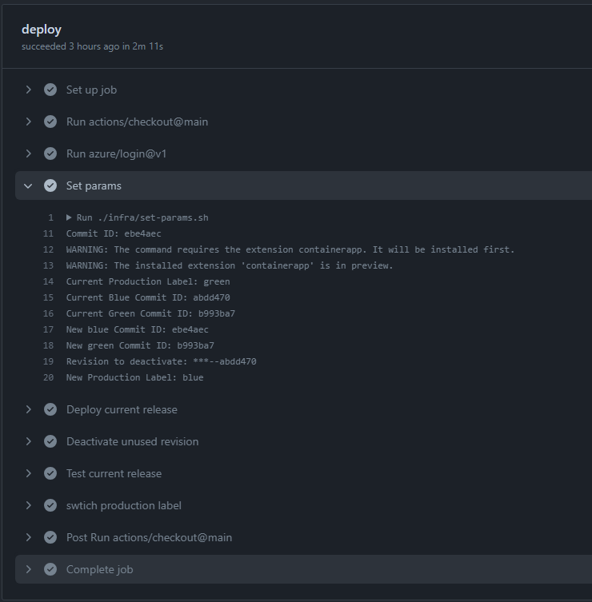

# ContainerApps Blue/Green

This is a sample project to demonstrate how to implement blue/green deployment CI workflow for container apps.

[Blue/Green Deployment](https://martinfowler.com/bliki/BlueGreenDeployment.html) is a software release strategy that aims to minimize downtime and reduce the risk associated with deploying new versions of an application. In a blue/green deployment, two identical environments, referred to as "blue" and "green," are set up. One environment (blue) is running the current application version and one environment (green) is running the new application version. Once testing has been completed in the green environment, the live application traffic is directed to the green environment and the blue environment can be used to deploy new application version during next deployment cycle.

In the context of Azure Container Apps, the blue/green deployment release approach is enabled by using [container apps revisions](https://learn.microsoft.com/en-us/azure/container-apps/revisions), [traffic weights](https://learn.microsoft.com/en-us/azure/container-apps/traffic-splitting), and [revision labels](https://learn.microsoft.com/en-us/azure/container-apps/revisions#revision-labels).

## Features

The sample demonstrates the following:

* How to use github actions to build and deploy container apps revisions with Azure Bicep template
* How to to switch the traffic between blue/green revisions
* How to iterate between blue/green revisions during deployment cycles
* How to make the github workflow idempotent so that it can be re-run for the same commit without causing any issues
* How to prevent accumulation of unused active revisions when deploying frequently

## Getting Started

### Prerequisites

* [Azure CLI](https://docs.microsoft.com/en-us/cli/azure/install-azure-cli).
* [Azure Container Apps CLI](https://docs.microsoft.com/en-us/azure/container-apps/quickstart-cli).
* An existing [Azure Container App Environment](https://learn.microsoft.com/en-us/azure/container-apps/environment) where the sample app will be deployed to.

### Installation

To install the sample, you will need to fork the repository and then add the following [github action secrets](https://github.com/Azure/actions-workflow-samples/blob/master/assets/create-secrets-for-GitHub-workflows.md):

* `AZURE_CREDENTIALS` - Azure service principal credentials with permissions to create and manage resources in your subscription and resource group. Refer to [Azure login action with a service principal secret](https://learn.microsoft.com/en-us/azure/developer/github/connect-from-azure?tabs=azure-portal%2Cwindows#use-the-azure-login-action-with-a-service-principal-secret).
* `AZURE_ENVIRONMENT_NAME` - the short name of the existing Azure Container Apps environment where the sample app will be deployed to, for example `mycontainerappenv`. Do not use the full environment ARM resource id.
* `AZURE_RG` - the name of the existing Azure resource group where the sample app will be deployed to.
* `AZURE_APP_NAME` - the name of the containerapp where the sample app will be deployed to.
* `AZURE_APP_DNSSUFFIX` - the default domain of the containerapp environment where the sample app will be deployed to, for example `whitedesert-078f44c6.eastus.azurecontainerapps.io`. You can use this command to get it:

```bash
az containerapp env show -g $RESOURCE_GROUP -n $APP_ENVIRONMENT_NAME --query properties.defaultDomain
```

Next you will need to create a container app by running this command:

```bash
export APP_NAME=<APP_NAME>
export APP_ENVIRONMENT_NAME=<APP_ENVIRONMENT_NAME>
export RESOURCE_GROUP=<RESOURCE_GROUP>

# Any random commitId that is assumed to correspond to the app code currently in production
export BLUE_COMMIT_ID=0b699ef

cd ./infra

# create a new app with a blue revision
az deployment group create \
    --name createapp-$BLUE_COMMIT_ID \
    --resource-group $RESOURCE_GROUP \
    --template-file main.bicep \
    --parameters appName=$APP_NAME blueCommitId=$BLUE_COMMIT_ID containerAppsEnvironmentName=$APP_ENVIRONMENT_NAME \
    --query properties.outputs.fqdn
````

## Demo

Check the [github workflow](https://github.com/Azure-Samples/containerapps-blue-green/actions) for this repo.

If using your own fork - push any commit to the `main` branch and check the github actions workflow run. The workflow will deploy a new revision of the app and switch the traffic to it. An example workflow run would look as shown below:


